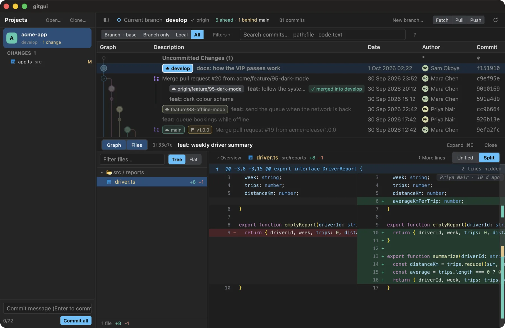
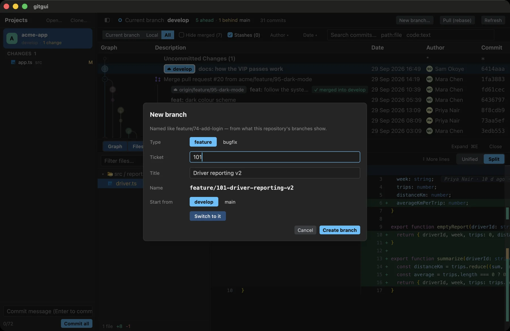
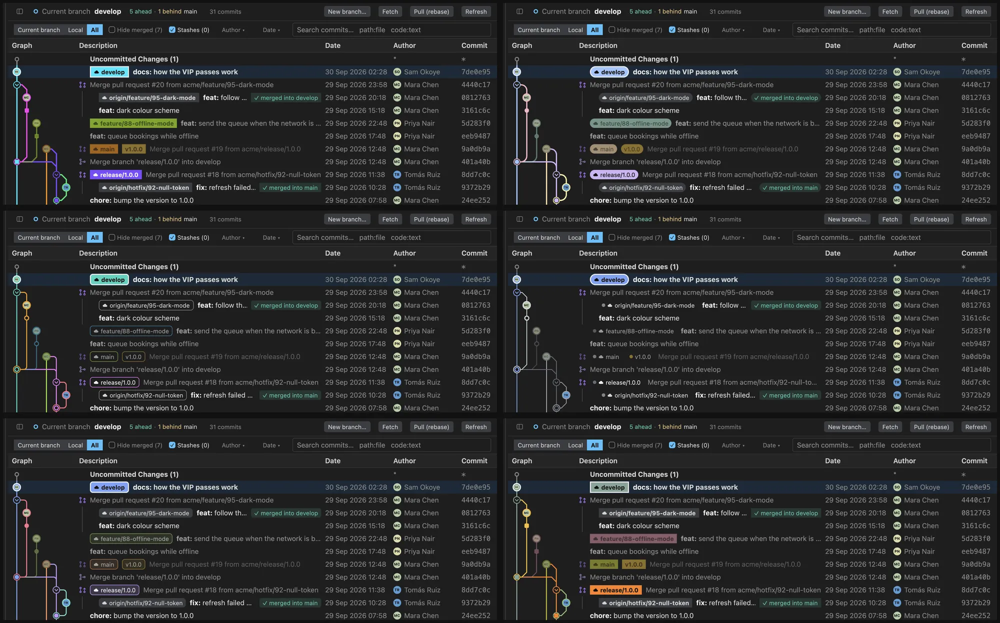
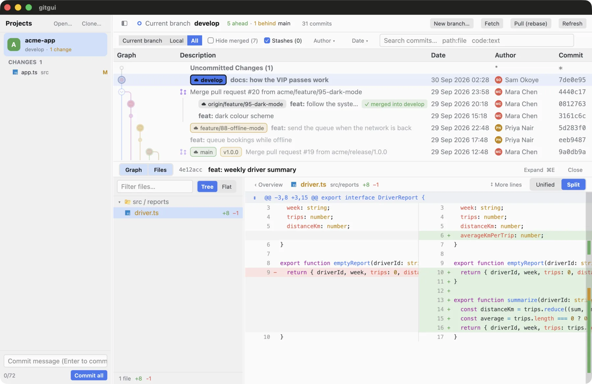

<div align="center">

# gitgui

**A fast, native Git client that understands pull requests.**


<br>


</div>

<br>

## Why you'll like it

- **It knows what's merged.** Squash and rebase merges leave no trace in git, so other tools show the branch as open forever. gitgui finds them and marks the branch **✓ squash-merged**.
- **Pull requests, tidy.** A pull request's commits sit together under it and fold away.
- **It remembers your team's workflow.** Branch names, where work starts, how things merge: read from the repo, then **New branch…** builds `feature/74-driver-reporting` for you.
- **Conflicts, explained.** Resolve them without leaving the app, with each side named plainly (never "ours/theirs") and who changed it and why in front of you. The merge question tells you beforehand if it will conflict.
- **Blame where you're looking.** Rest the pointer on a line in a diff: who changed it, and when.
- **Where is it used?** Cmd-click a word in a diff: the files that use it in that commit, the line that declares it first, each one click from the whole file.
- **Yours to restyle.** 14 graph styles, each with its own lines, commit marks and labels.
- **Fast.** Native Rust, no Electron: thousands of commits and 10,000-line diffs scroll smoothly.

<br>

## See it



*Split diff, with who-changed-this one hover away. Comment on any line.*

<br>



*Start a branch the way your team does: click a type for its prefix (or skip it), add a ticket and a title. Start from opens a searchable list of local and remote branches.*

<br>



*Six of the 14 styles. Colours are fitted to your theme, so every line stays readable.*

<details>
<summary>Light theme</summary>
<br>

</details>

<br>

## Get it

**Download** for macOS (Apple silicon and Intel) or Windows from [Releases](https://github.com/chanphiromsok/gitgui/releases). It needs `git` on your PATH.

**Or build it** (Rust, stable):

```sh
cargo run --release -p gitgui-app -- /path/to/repo
```

<br>

## More

[Guide](docs/guide.md): everything it does · [Feature spec](docs/feature-spec.md): how it is built · MIT
