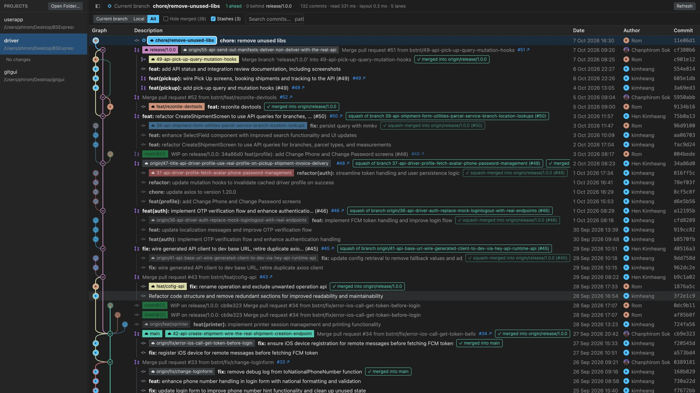

# gitgui

A fast Git GUI in Rust, on GPUI, for reading history on repositories that work through pull requests.



**What it fixes**

- **"Is this branch merged?"** Squash and rebase merges leave no link in git history, so most tools show the branch as unmerged forever. gitgui finds them (same changes, same PR number, same messages) and marks the branch *✓ squash-merged into release/1.0.0 (#45)*. The squash commit says *squash of branch …*.
- **A pull request's commits are scattered through the log.** They are listed indented under the PR, with a guide line, and fold away.
- **Where did this branch start?** Each branch is one coloured line down to its fork point, with the current branch ringed.
- **Slow on big histories.** It scrolls 10,000-line diffs and thousands of commits smoothly, and refreshes do not re-scan.

Also: a **Pull (rebase)** button, the last project reopens at start, a Graph size setting, author pictures (Gravatar, and GitHub through `gh` for plain-email authors), Tree/Flat file list, Unified/Split diff (both remembered), line comments, and right-click checkout, merge, rebase, push and more, always asking before anything destructive. Feature inventory and architecture: `docs/feature-spec.md`.

## Build and run

You need [Rust](https://rustup.rs) (stable, 1.90 or newer) and `git` on your PATH. The app runs your own `git`, so your config, hooks and credentials apply.

```sh
cargo run --release -p gitgui-app -- /path/to/repo   # open the window (the path is optional)
cargo test --workspace                               # all tests
```

Always use `--release` to run it. A debug build of the UI is far too slow to scroll.

Saved projects, settings and comments live in `~/Library/Application Support/gitgui` (macOS), `%APPDATA%\gitgui` (Windows) or `~/.local/share/gitgui` (Linux). Set `GITGUI_DATA_DIR` to use another folder.

## Release build: macOS

Needs Xcode or the Command Line Tools (`xcode-select --install`). The Metal shader compiler is **not** needed: the app compiles its shaders when it starts (`runtime_shaders`).

```sh
scripts/bundle-macos.sh                  # this Mac's architecture
scripts/bundle-macos.sh --arch arm64     # Apple Silicon (can be built on an Intel Mac too)
scripts/bundle-macos.sh --arch x86_64    # Intel (can be built on an Apple Silicon Mac)
scripts/bundle-macos.sh --arch universal # both in one app
```

This writes `dist/gitgui.app` and `dist/gitgui-<version>-macos-<arch>.dmg`. Drag the app to Applications.

**The icon** is `crates/app/assets/app-icon/icon.svg`. After changing it, make `AppIcon.icns` again:

```sh
cargo run -p gitgui-app --example app_icon -- /tmp/AppIcon.iconset && iconutil -c icns /tmp/AppIcon.iconset -o crates/app/assets/app-icon/AppIcon.icns
```

**Signing.** The script signs ad hoc, which is enough to run on the Mac that built it. On another Mac, Gatekeeper blocks it: right-click the app and choose Open once, or run `xattr -dr com.apple.quarantine gitgui.app`.
To distribute properly you need an Apple Developer ID: sign with `codesign --force --deep --options runtime --sign "Developer ID Application: NAME (TEAMID)" dist/gitgui.app`, then notarize with `xcrun notarytool submit dist/gitgui-<version>-macos-<arch>.dmg --keychain-profile PROFILE --wait` and `xcrun stapler staple dist/gitgui-<version>-macos-<arch>.dmg`.

## Publishing a release on GitHub

`.github/workflows/release.yml` builds the macOS Apple Silicon and Intel `.dmg` files and the Windows `.zip`, then drafts a GitHub release with them and a `SHA256SUMS` file. It never publishes by itself: open the draft, read it, press **Publish**.

```sh
# 1. Set `version` in the root Cargo.toml, commit, push.
# 2. Tag it; the workflow starts on the tag:
git tag v0.1.0 && git push origin v0.1.0
```

Or run it by hand without a tag: GitHub → Actions → release → Run workflow, and type the tag (`v0.1.0`). The tag is created when you publish the draft. The install notes in the release body come from `.github/release-notes.md`.

## Release build: Windows

The release workflow builds it on a Windows runner (cross-compiling GPUI from another OS is not supported). **It has never been run on a real Windows machine**, and the first workflow run may need fixes; check that run before relying on it. Shortcuts use Ctrl there, the code font is Consolas, and no console window opens.

1. Install [Rust](https://rustup.rs) with the default `x86_64-pc-windows-msvc` toolchain.
2. Install **Visual Studio Build Tools** with the *Desktop development with C++* workload and a Windows 10/11 SDK.
3. Install [Git for Windows](https://git-scm.com/download/win) and make sure `git` works in a terminal.
4. In PowerShell, from the project folder:

```powershell
cargo build --release -p gitgui-app
```

The program is `target\release\gitgui-app.exe`. It is a single file: copy it anywhere. For an installer, wrap it with [WiX](https://wixtoolset.org) or [Inno Setup](https://jrsoftware.org/isinfo.php); sign it with `signtool` to avoid SmartScreen warnings.

Known Windows gaps:
- The menu bar is macOS-only; Minimize, Hide and the other macOS window shortcuts do nothing there.
- The program has no icon of its own, and is not signed (SmartScreen warns).
- Git is found on PATH only.

## Release build: Linux

Install the system libraries GPUI needs (on Debian/Ubuntu: `libxkbcommon-x11-dev libwayland-dev libxcb1-dev libfontconfig-dev libssl-dev pkg-config`), then `cargo build --release -p gitgui-app`. Not tested either, and it uses Ctrl for shortcuts and DejaVu Sans Mono for code.

## Layout

| Crate | What it is | Dependencies |
|---|---|---|
| `crates/core` | Repo model, `Backend` trait, `GitCli` backend, lane layout, diff parser, file tree | none (std only) |
| `crates/store` | Saved projects and line comments, as JSON in the app-data folder | serde |
| `crates/cli` | `gitgui log [PATH] [-n N]` prints the commit graph as text | core |
| `crates/app` | The GPUI window | core, store, gpui 0.2.2 |

`crates/app` is not in `default-members`, so a plain `cargo test` stays fast. Use `cargo test --workspace` for everything
and `cargo run -p gitgui-app -- [PATH]` for the window.

## What the window does

Left to right: **projects** | **graph** | **file pane**. Both dividers drag to resize.

- **Projects:** *Clone…* (Cmd-Shift-O) clones from an https, ssh (`git@host:owner/repo.git`) or git address into a folder you pick, then opens it; it uses the credentials your git already has and never asks for a password. *Open Folder…* (Cmd-O) adds a repository (a folder inside one adds the repo). Kept between launches; hover a row and click × to remove.
- **Local changes** list under the open project, staged and not: click one to see its diff, hover for **+** / **−** to stage or unstage (or a whole group). The box below commits what is staged (or everything, when nothing is), Enter to commit.
- **Graph:** Sourcetree-style table.
  - Each branch is one line with one color from its tip down to the commit it was branched from. Lines are not bent into their parent early, so the fork point is visible.
  - A fork commit gets a ring; its details name the branches cut from it. Selecting a commit brings its branch line forward and dims the rest.
  - Each commit's node shows its author's initials (Rom → R, Kim heang → KH) on its branch's color.
  - Icons tell a pull request, a merge and a plain commit apart. A local branch and its remote share one badge; the current branch is ringed and bold.
  - Stashes are one `stash@{n}` commit; an *Uncommitted Changes* row sits on top.
- **Settings** (Cmd-,) is a window with four pages: *Graph* (grouping, pictures, compact, size), *Files & diffs*, *Appearance* (theme cards, file icons) and *Projects* (clone folder, data folder). Everything saves as you change it.
- **Grouping** (Settings… / Cmd-,, on by default): a pull request's commits are listed one level in under it, with a guide line, and fold away with the chevron on the merge's dot in the graph. *Compact graph* (Settings) narrows the lanes and thins the lines.
  Squash-merged branches go under their squash commit.
- **Already merged?** A background scan marks branches that are merged even when git cannot tell (squash and rebase merges): *squash-merged into release/1.0.0 · #37*, and *squash of branch feat/x* on the commit that carries it.
  Evidence, strongest first: identical changes in one trunk commit; the same pull request number; a trunk commit repeating the branch's commit messages. The last two are shown in italics as guesses.
- **Pull requests** link to their page: *#42 ↗* beside a merge or squash commit, in its details, and *Open Pull Request / Open Commit in Browser* on right-click (GitHub, GitLab and Bitbucket remotes).
- **Right-click** a branch badge or a commit: checkout, rename, delete, merge into current, rebase current onto, push, new branch / tag here, cherry-pick, copy name / SHA / message.
  Anything that rewrites history, deletes, or reaches a remote asks first. Nothing is forced: no force-push, no `reset --hard`, and an unmerged branch is deleted only after a second, explicit yes.
  A merge, rebase or cherry-pick that meets conflicts stops and the banner offers **Abort**, which puts everything back.
- **File pane** (click a commit): overview, and the changed files as a **tree or flat list** with a filter. A file opens as a **unified or split** diff; **Show more lines** (on the toolbar or beside any hunk) widens the unchanged lines around every change: 25, 100, 400, then the whole file; **Collapse** goes back to 3. Long lines scroll sideways (shift + wheel, or a trackpad swipe), and a **minimap** strip on the right shows where the changes are: click or drag it to jump. Your choice of **Tree / Flat** and **Unified / Split** is saved as soon as you make it (also in Settings…) and is used the next time the app starts. **Expand** (Cmd-E, or double-click a file) gives the code the whole window: the sidebar and graph step aside until Esc. While a file is open the pane takes most of the width by default. The expand button (**↕**) sits in the line-number gutter of each hunk header. Scrolling is locked to one direction at a time, and the wheel works over the minimap too.
- **Filter bar** above the graph: show the *current branch*, *local* branches or *all*; *hide merged* branches; show or hide *stashes* (a stash shows where the commit it was made on does); search (Cmd-F) by message, author, branch or id, `path:` for commits touching a file, `code:` for commits adding or removing text. Enter goes to the next match.
- **Syntax highlighting** in diffs (tree-sitter, 21 languages including PHP). Each line is colored from the whole file it came from, so hunks that start mid-string still color right.
- **Themes** (Settings): Zed's theme format. gitgui Dark, One Dark and One Light are built in; themes installed in Zed show up, or drop a Zed theme file in `<data folder>/themes/`.
- **File icons:** the Material Icon Theme is built in; icon themes installed in Zed can be picked instead. A deleted file is marked *(Deleted)*; folders in the file tree fold.
- **Authors** show their picture beside their name (GitHub's for GitHub no-reply emails, else Gravatar's), or their initials. Pictures are kept for a week in `<data folder>/avatars`; Settings turns fetching off. One person under several identities (a laptop's git config, GitHub's web merges) gets one picture, initials and color: identities are joined when they are the same GitHub account, or when one committed the other's work and no one else's. A `.mailmap` is honored too.
- **Images** (PNG, JPEG, GIF, WebP, BMP, TIFF, SVG) show before and after, with their size in pixels and bytes.
- **Sidebar:** the button at the top left of the graph, Cmd-B, or drag its divider all the way left hides it.
- **Comments:** hover a diff line and click **+**. Saved locally per repository by commit, file, side and line, so they never go stale.
- **Shortcuts:** Cmd-O open, Cmd-, settings, Cmd-R refresh, Cmd-F search commits, Cmd-B show or hide the sidebar, Up / Down step through the open commit's (or local changes') files, Cmd-E full view, Esc back (closes a menu, dialog or settings first), Cmd-W close window, Cmd-M minimize, Cmd-Q quit.

`gitgui merges PATH` prints the merge scan for a repository from the terminal (read-only).

## Tests

`cargo test --workspace`: 217 tests. Core and store run against real temporary git repositories, including real squash merges, conflicts, a local "remote" for push, and a 300-case random test that grouping never puts a commit above its parent.
The app tests run the real window headlessly (GPUI's test platform) through every flow and draw a frame after each step, so a view that panics on real data fails.
Frame-time checks keep a 10,000-row diff and a 4,400-row graph under 8 ms per frame in release builds.
They do not check how anything looks.

## Third-party assets

`crates/app/assets/material-icons/` is the [Material Icon Theme](https://github.com/material-extensions/vscode-material-icon-theme) by Philipp Kief and contributors, MIT licensed (its `LICENSE` is beside it).

## Known gaps

- Comments are one line each and local only. Syncing with GitHub/GitLab review comments is not built.
- No word-level highlight inside changed lines.
- Divider positions and folded groups are not remembered between launches.
- The merge scan looks at each trunk's newest 500 commits and gives up after 25 s (it says how many branches it skipped; the next refresh carries on from there). It remembers its answers, so a refresh only re-checks branches and trunks that moved.
- Menu items from Sourcetree not built: *Create Archive*, *Unselect in Branches Dropdown* (there is no branch dropdown yet).
- `crates/app/src/text_input.rs` is adapted from gpui's `input` example (Apache-2.0, Zed Industries).
- 