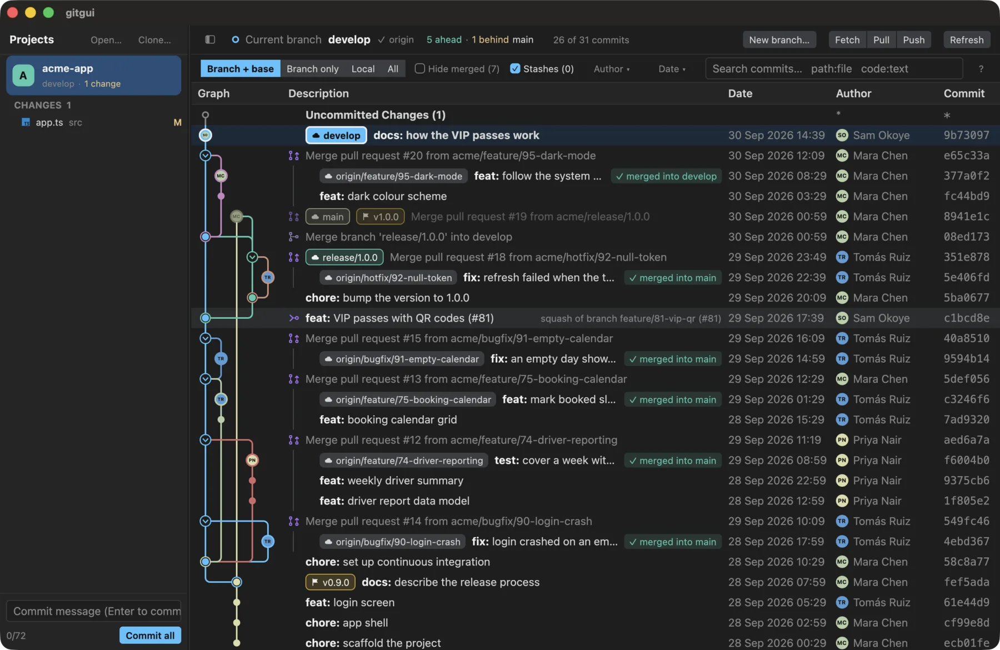

# gitgui guide

Everything gitgui does, in one place. The short version is the [README](../README.md); what each part is made of is in the [feature spec](feature-spec.md).

A fast Git GUI in Rust, on GPUI, for reading history on repositories that work through pull requests.



**What it fixes**

- **"Is this branch merged?"** Squash and rebase merges leave no link in git history, so most tools show the branch as unmerged forever. gitgui finds them (same changes, same PR number, same messages) and marks the branch *✓ squash-merged into release/1.0.0 (#45)*. The squash commit says *squash of branch …*.
- **A pull request's commits are scattered through the log.** They are listed indented under the PR, with a guide line, and fold away.
- **Where did this branch start?** Each branch is one coloured line down to its fork point, with the current branch ringed.
- **Slow on big histories.** It scrolls 10,000-line diffs and thousands of commits smoothly, and refreshes do not re-scan.

Also: **Fetch**, **Pull** (rebase) and **Push** buttons (the one that matters is lit: Push when the branch is ahead or not on the remote yet, Pull when it is behind; the header says `↑2 origin`, `✓ origin` or `not on a remote yet`; both always ask first and never force), an optional **automatic fetch** (Settings → Projects: off, or every 5, 15 or 30 minutes), the New branch window's **Push to origin**, a note in the Start from list when a local branch is behind its remote, the last project reopens at start, a Graph size setting, author pictures (Gravatar, and GitHub through `gh` for plain-email authors), Tree/Flat file list, Unified/Split diff (both remembered), line comments, and right-click checkout, merge, rebase, push and more, always asking before anything destructive. Feature inventory and architecture: [the feature spec](feature-spec.md).

## Build and run

You need [Rust](https://rustup.rs) (stable, 1.90 or newer) and `git` on your PATH. The app runs your own `git`, so your config, hooks and credentials apply.

```sh
cargo run --release -p gitgui-app -- /path/to/repo   # open the window (the path is optional)
cargo test --workspace                               # all tests
```

Always use `--release` to run it. A debug build of the UI is far too slow to scroll.

Saved projects, settings and comments live in `~/Library/Application Support/gitgui` (macOS), `%APPDATA%\gitgui` (Windows) or `~/.local/share/gitgui` (Linux). Set `GITGUI_DATA_DIR` to use another folder.

## Release build: macOS

Needs Xcode or the Command Line Tools (`xcode-select --install`). The Metal shader compiler is **not** needed: the app compiles its shaders when it starts (`runtime_shaders`).

```sh
scripts/bundle-macos.sh                  # this Mac's architecture
scripts/bundle-macos.sh --arch arm64     # Apple Silicon (can be built on an Intel Mac too)
scripts/bundle-macos.sh --arch x86_64    # Intel (can be built on an Apple Silicon Mac)
scripts/bundle-macos.sh --arch universal # both in one app
```

This writes `dist/gitgui.app` and `dist/gitgui-<version>-macos-<arch>.dmg`. Drag the app to Applications.

**The icon** is `crates/app/assets/app-icon/icon.svg`. After changing it, make `AppIcon.icns` again:

```sh
cargo run -p gitgui-app --example app_icon -- /tmp/AppIcon.iconset && iconutil -c icns /tmp/AppIcon.iconset -o crates/app/assets/app-icon/AppIcon.icns
```

**Signing.** The script signs ad hoc, which is enough to run on the Mac that built it. On another Mac, Gatekeeper blocks a downloaded copy (notarizing needs a paid Apple account). Run `xattr -dr com.apple.quarantine gitgui.app` once; or on macOS 15 and newer open it, press Done, and use System Settings → Privacy & Security → Open Anyway; or on macOS 14 and older right-click the app and choose Open. A copy fetched with `curl` carries no quarantine mark, so it opens without any of this.
To distribute properly you need an Apple Developer ID: sign with `codesign --force --deep --options runtime --sign "Developer ID Application: NAME (TEAMID)" dist/gitgui.app`, then notarize with `xcrun notarytool submit dist/gitgui-<version>-macos-<arch>.dmg --keychain-profile PROFILE --wait` and `xcrun stapler staple dist/gitgui-<version>-macos-<arch>.dmg`.

## Publishing a release on GitHub

`.github/workflows/release.yml` builds the macOS Apple Silicon and Intel `.dmg` files and the Windows `.zip`, then drafts a GitHub release with them and a `SHA256SUMS` file. It never publishes by itself: open the draft, read it, press **Publish**.

```sh
# 1. Set `version` in the root Cargo.toml, commit, push.
# 2. Tag it; the workflow starts on the tag:
git tag v0.1.0 && git push origin v0.1.0
```

Or run it by hand without a tag: GitHub → Actions → release → Run workflow, and type the tag (`v0.1.0`). The tag is created when you publish the draft. The install notes in the release body come from `.github/release-notes.md`.

## Release build: Windows

The release workflow builds it on a Windows runner (cross-compiling GPUI from another OS is not supported). **It has never been run on a real Windows machine**, and the first workflow run may need fixes; check that run before relying on it. Shortcuts use Ctrl there, the code font is Consolas, and no console window opens.

1. Install [Rust](https://rustup.rs) with the default `x86_64-pc-windows-msvc` toolchain.
2. Install **Visual Studio Build Tools** with the *Desktop development with C++* workload and a Windows 10/11 SDK.
3. Install [Git for Windows](https://git-scm.com/download/win) and make sure `git` works in a terminal.
4. In PowerShell, from the project folder:

```powershell
cargo build --release -p gitgui-app
```

The program is `target\release\gitgui-app.exe`. It is a single file: copy it anywhere. For an installer, wrap it with [WiX](https://wixtoolset.org) or [Inno Setup](https://jrsoftware.org/isinfo.php); sign it with `signtool` to avoid SmartScreen warnings.

Known Windows gaps:
- The menu bar is macOS-only; Minimize, Hide and the other macOS window shortcuts do nothing there.
- The program has no icon of its own, and is not signed (SmartScreen warns).
- Git is found on PATH only.

## Release build: Linux

Install the system libraries GPUI needs (on Debian/Ubuntu: `libxkbcommon-x11-dev libwayland-dev libxcb1-dev libfontconfig-dev libssl-dev pkg-config`), then `cargo build --release -p gitgui-app`. Not tested either, and it uses Ctrl for shortcuts and DejaVu Sans Mono for code.

## Layout

| Crate | What it is | Dependencies |
|---|---|---|
| `crates/core` | Repo model, `Backend` trait, `GitCli` backend, lane layout, diff parser, file tree | none (std only) |
| `crates/store` | Saved projects and line comments, as JSON in the app-data folder | serde |
| `crates/cli` | `gitgui log [PATH] [-n N]` prints the commit graph as text | core |
| `crates/app` | The GPUI window | core, store, gpui 0.2.2 |

`crates/app` is not in `default-members`, so a plain `cargo test` stays fast. Use `cargo test --workspace` for everything
and `cargo run -p gitgui-app -- [PATH]` for the window.

## What the window does

Left to right: **projects** | **graph** with the **file pane** below it (or beside it). The dividers drag to resize.

- **Projects:** *Clone…* (Cmd-Shift-O) clones from an https, ssh (`git@host:owner/repo.git`) or git address into a folder you pick, then opens it; it uses the credentials your git already has and never asks for a password. *Open Folder…* (Cmd-O) adds a repository (a folder inside one adds the repo). Kept between launches; hover a row and click × to remove.
- **Local changes** list under the open project, staged and not: click one to see its diff, hover for **+** / **−** to stage or unstage (or a whole group). The box below commits what is staged (or everything, when nothing is), Enter to commit.
- **Graph:** Sourcetree-style table.
  - Each branch is one line with one color from its tip down to the commit it was branched from. Lines are not bent into their parent early, so the fork point is visible.
  - A fork commit gets a ring; its details name the branches cut from it. Selecting a commit brings its branch line forward and dims the rest.
  - Each commit's node shows its author's initials (Rom → R, Kim heang → KH) on its branch's color.
  - Icons tell a pull request, a merge and a plain commit apart. A local branch and its remote share one badge; the current branch is ringed and bold.
  - Stashes are one `stash@{n}` commit; an *Uncommitted Changes* row sits on top.
- **Settings** (Cmd-,) is a window with five pages: *Graph* (grouping, pictures, compact, size), *Graph style*, *Files & diffs*, *Appearance* (theme cards, file icons) and *Projects* (clone folder, data folder). Everything saves as you change it.
- **Graph style** (Settings): 14 looks for the graph, each a set of choices and not only a recolor: its own palette (fitted to your color theme so every line keeps at least 3:1 contrast with the background), how a line changes lane (curve, straight diagonal, or right angle with a rounded corner), line weight, how a commit is marked (dot, hollow ring, square), and how branch, tag and stash labels look (tinted, solid, outline, pill, capsule, dot, block). Theme (your color theme's own), Aurora, Neon, Soft, Circuit, Graphite, Colour-blind safe (Okabe–Ito), Gruvbox, Dracula, Catppuccin, Solarized, Tokyo Night, Sunset and Ocean. Each card draws a small history in its style. The tests check every style against every built-in theme.
- **What the graph shows** (the bar above it): *Branch + base* (the default) is the branch you are on, the branch it was cut from (the project's workflow base if it names one) and their remote copies, so you see where your work stands against the trunk and the remote without the other branches around it. *Branch only* is just the history under HEAD; *Local* adds your other branches; *All* adds remote-only branches too. *Sync merges (N)* shows the merges that only bring the trunk into a branch ("Merge branch 'release/1.0.0' into feat/x"); they are left out by default and keep their own mark when shown. The **?** at the right of the bar is the key to every mark in the graph: pull request, squashed pull request, merge, sync merge, "merged into" and "already in" (a branch whose commits are part of another with no merge commit: it was fast-forwarded).
- **Where you stand**: a commit only on your machine has a green **↑** (a push would send it), one only on the remote has an amber **↓** and a hollow dot (a pull would bring it), as of the last fetch; a branch that is not on a remote yet marks everything a first push would send. Tags are flags (⚑) on their commits. Pointing at a row brings its branch line forward and dims the others; clicking a branch's label picks that branch out with the one it was cut from (a chip in the bar, or Esc, puts the others back).
- **Rebase, shown**: after a rebase (or a pull with rebase) the new commits and the old ones they replace are marked **≈** with each other's id — they make the same changes — and pointing at one lights the other; the old ones on the remote carry ↓ and the new ones ↑. A bar under the filter bar says "feat/x was rebased onto 3f2a1b9: 3 commits rewritten" with **Undo rebase**, which (after asking) moves the branch back to where it was, from the reflog. It shows only while the rebase is the last thing that happened to the branch and the rewritten commits are not on the remote yet, and it never moves the branch over changes you have not committed; the rebased commits stay in the reflog.
- **Pull requests and issues** (GitHub): Settings → GitHub, or the *Sign in with GitHub* button under a GitHub project in the sidebar. gitgui shows a short code and opens `github.com/login/device`; you type the code and approve there ([device flow](https://docs.github.com/en/apps/creating-github-apps/authenticating-with-a-github-app/generating-a-user-access-token-for-a-github-app) for a GitHub App), and no password comes through gitgui. The app asks for *read-only* access to pull requests and issues, on the repositories you install it on; it cannot read your code or change anything. The token lasts eight hours at a time and renews itself; it is kept in the macOS Keychain or the Windows Credential Manager, never in a file of ours. Under the open project the sidebar then lists its pull requests (the ones waiting for your review first) and issues, and `Graph | Pull requests | Issues` tabs above the graph open the full lists with *Open / Mine / Needs my review / Closed* filters and a detail panel you can drag wider or narrower by its divider: title and state, who it is assigned to (or *Unassigned*), reviewers, labels in the repository's own colors, the buttons *Show in graph* (picks the branch out), *Check out branch* (not for a fork's) and *Open on GitHub*, and the description read as markdown (headings, lists and tasks, quotes, code, links, bold and italic; raw HTML and comments are dropped). A picture in a description shows as an *Image … Open* link, not as the picture: it would be a request to a server gitgui did not choose, and GitHub does not answer it for a private repository without a browser's cookie. A repository the app is not installed on says so, with a button to install it. `GITGUI_GITHUB_FIXTURE=folder` answers from files (`user.json`, `pulls.json`, `pulls_closed.json`, `issues.json`, `issues_closed.json`) for looking at the interface without signing in.
- **Lanes**: a history with more than six lanes draws the far ones as one gray lane, with a **+N** button above the graph to open them (and *Draw every lane* in Settings to always open them). Selecting a commit brings its own line back in color.
- **Grouping** (Settings… / Cmd-,, on by default): a pull request's commits are listed one level in under it, with a guide line, and fold away with the chevron on the merge's dot in the graph. *Compact graph* (Settings) narrows the lanes and thins the lines.
  Squash-merged branches go under their squash commit.
- **Already merged?** A background scan marks branches that are merged even when git cannot tell (squash and rebase merges): *squash-merged into release/1.0.0 · #37*, and *squash of branch feat/x* on the commit that carries it.
  Evidence, strongest first: identical changes in one trunk commit; the same pull request number; a trunk commit repeating the branch's commit messages. The last two are shown in italics as guesses.
- **Pull requests** link to their page: *#42 ↗* beside a merge or squash commit, in its details, and *Open Pull Request / Open Commit in Browser* on right-click (GitHub, GitLab and Bitbucket remotes).
- **Filter by author and date:** the **Author ▾** and **Date ▾** chips in the filter bar pick an author (everyone who committed, most active first; a person's other emails count too) or a day range (today, yesterday, last 7 or 30 days, this month). They write plain words into the search box, which you can also type: `author:ada` (part of a name or an email; `author:"Ada Lovelace"` with spaces), `date:2026-10-05`, `date:2026-10-01..2026-10-07` (either end may be left open), `date:2026-10` (a month), `date:today`, `date:7d`, `since:`/`until:`. The graph then shows only those commits and keeps its lines joined across the ones left out, the way `git log` does; other words in the box still mark rows as before.
- **Right-click** a branch badge or a commit: checkout, rename, delete, merge into current, rebase current onto, push, new branch / tag here, cherry-pick, copy name / SHA / message.
  Anything that rewrites history, deletes, or reaches a remote asks first. Nothing is forced: no force-push, no `reset --hard`, and an unmerged branch is deleted only after a second, explicit yes.
  Before a merge, rebase, pull or cherry-pick, the question says what a test merge found (`git merge-tree`, which touches nothing; git 2.38 or newer): *Merges cleanly*, or *Would conflict in 2 files: config.rs, app.css*. A merge and a cherry-pick are tested exactly as git will run them; for a rebase or a pull the two tips are merged once, so it only says *may conflict*. The question works the same while the test runs, or when git cannot say.
  One that meets conflicts stops and opens its first file in the resolver (below).
- **File pane** (click a commit): overview, and the changed files as a **tree or flat list** with a filter. A file opens as a **unified or split** diff; The **arrows** in the line-number gutter show 20 more unchanged lines on the side they point to: **↑** over a hunk, **↓** under the hunk before it (and at the end of the file), with how many lines are still hidden said at the end of the row; a gap shown in full joins the two hunks. **More lines** on the toolbar widens the unchanged lines around every change at once: 25, 100, 400, then the whole file; **Collapse** goes back to 3. Long lines scroll sideways (shift + wheel, or a trackpad swipe), and a **minimap** strip on the right shows where the changes are: click or drag it to jump. Your choice of **Tree / Flat** and **Unified / Split** is saved as soon as you make it (also in Settings…) and is used the next time the app starts. The file pane sits **below the graph**, across the whole width (Settings → Files & diffs → Review layout switches to beside it); a divider between them drags. A diff opens **split** unless you choose unified. A new or deleted file has one side only, so it is shown as one column labelled *(New file)* or *(Deleted)*. Every panel can be hidden and still reached: **Graph** and **Files** in the pane header, the sidebar button or Cmd-B. A thin strip stays where a hidden panel was; point at it and the panel slides in over the code until the pointer leaves. The file list has a divider you drag to resize. **Expand** (Cmd-E, or double-click a file) gives the code the whole window: the sidebar and graph step aside until Esc. While a file is open the pane takes most of the width by default. Scrolling is locked to one direction at a time, and the wheel works over the minimap too.
- **Filter bar** above the graph: show the *current branch*, *local* branches or *all*; *hide merged* branches; show or hide *stashes* (a stash shows where the commit it was made on does); search (Cmd-F) by message, author, branch or id, `path:` for commits touching a file, `code:` for commits adding or removing text. Enter goes to the next match.
- **Conflicts:** a file a merge, rebase or cherry-pick left in conflict is listed under *Conflicts* in the local changes and opens in the resolver instead of a diff (the graph steps aside while an operation is in progress, and comes back when it ends).
  - The two sides are named by what they mean, never "ours" and "theirs" (which a rebase swaps): *On main* and *Coming in from feature/x* for a merge, *Already on main* and *Your commit: …* for a rebase, *On main* and *The picked commit: …* for a cherry-pick.
  - Above the conflicts, the commits that changed the file on each side since the sides split, with who and when: why each side is the way it is. Each conflict also says who last changed its lines on each side.
  - Each conflict is a card: the two sides next to each other (one under the other in a narrow pane, or with Unified chosen), what both sides started from (*Base* in the toolbar shows or hides it), an **Accept** button in each side's own header (it turns into a filled *✓ Accepted* when chosen), *Accept both* and *Keep original* (the lines as they were before either change) in the card's header, and the result as it will be written. Clicking a filled button, or *undo* on the result line, takes the choice back; *swap order* reverses *Accept both*.
  - **Resolve the N safe ones** decides only what needs no guess: both sides made the same change spaced differently, or one side only re-spaced or re-indented the lines (trailing spaces and line endings only, in Python, YAML and Makefiles, where indentation is code). Each says why under it; *Start over* undoes it. Both sides adding lines where there were none is only a suggestion to keep both, applied when you click it.
  - Nothing is written until **Use this result** (⌘↩). With every conflict decided, the file is written and marked resolved (`git add`) and the next file opens; with some left, it is written with conflict markers named by meaning, to finish here or in an editor. A file changed on disk since it was read is never written over.
  - **Edit in editor** opens the file in its usual program; **Re-read** picks up what you saved there, and a file with no markers left can be marked resolved as it is. **Start over** forgets the choices, or, for a file that was edited, puts back git's conflict (asking first).
  - A binary file shows both versions (pictures side by side) and one is chosen whole; a file deleted on one side and changed on the other is kept or deleted, with the reason in plain words.
  - Keys: N / P (or J / K) next and previous conflict, 1 the current side, 2 the incoming side, 3 both (current first), 4 both (incoming first), 0 keep the original, Backspace take the choice back, ⌘↩ use the result.
  - While the operation is in progress, a bar over the main area says what it is (*Rebasing feature onto main · commit 2 of 3*) and how many files are left, with **Continue** once none are (with no editor; a rebase that meets conflicts in its next commit stops again and opens them), **Skip commit** for a rebase or cherry-pick, and **Abort**, which asks first. It is read from git, so it is there after the app is started again.
- **Syntax highlighting** in diffs (tree-sitter, 21 languages including PHP). Each line is colored from the whole file it came from, so hunks that start mid-string still color right.
- **Workflow** (New branch…, and Settings → Workflow): every team names branches its own way, and nobody remembers the rule, so gitgui reads it from the branches the repository already has: the words they start with (`feature`, `bugfix`), whether a ticket comes first (`feature/74-driver-reporting`), and where work starts (`develop` when there is one, else where branches were merged). **New branch…** (in the graph header) asks for a type, an optional ticket and a title, shows the name it makes, starts it from the team's branch (or the current one, or another you pick), and switches to it. A new branch does not track the branch it started from; its first push sets its own upstream. The first branch you make this way keeps these choices for the project; Settings → Workflow shows what was learned in words, and lets you change the name shape, the types and the starting branch, or forget it. When a name you type for a new or renamed branch breaks the habit, a hint under it says so; it never blocks. Kept per project, on this computer.
- **Blame on hover**: rest the pointer on a line of a diff and a small note at the end of that line says who last changed it, when, and the commit's message (`phirom · 13 h ago · gitgui: Git GUI in Rust on GPUI`). Click it to go to that commit in the graph. A removed line is blamed as the commit's parent had it, a line the selected commit changed says *This change*, and a working-tree line says *Not committed yet*. It is read the first time you point at a line (`git blame`, ignoring whitespace-only changes), in the background, so a diff you only read costs nothing.
- **Themes** (Settings): Zed's theme format. gitgui Dark, One Dark and One Light are built in; themes installed in Zed show up, or drop a Zed theme file in `<data folder>/themes/`.
- **File icons:** the Material Icon Theme is built in; icon themes installed in Zed can be picked instead. A deleted file is marked *(Deleted)*; folders in the file tree fold.
- **Authors** show their picture beside their name (GitHub's for GitHub no-reply emails, else Gravatar's), or their initials. Pictures are kept for a week in `<data folder>/avatars`; Settings turns fetching off. One person under several identities (a laptop's git config, GitHub's web merges) gets one picture, initials and color: identities are joined when they are the same GitHub account, or when one committed the other's work and no one else's. A `.mailmap` is honored too.
- **Images** (PNG, JPEG, GIF, WebP, BMP, TIFF, SVG) show before and after, with their size in pixels and bytes.
- **Sidebar:** the button at the top left of the graph, Cmd-B, or drag its divider all the way left hides it.
- **Comments:** hover a diff line and click **+**. Saved locally per repository by commit, file, side and line, so they never go stale.
- **Shortcuts:** Cmd-O open, Cmd-, settings, Cmd-R refresh, Cmd-F search commits, Cmd-B show or hide the sidebar, Up / Down step through the open commit's (or local changes') files, Cmd-E full view, Esc back (closes a menu, dialog or settings first), Cmd-W close window, Cmd-M minimize, Cmd-Q quit. The resolver's keys are listed under *Conflicts*.

`gitgui merges PATH` prints the merge scan for a repository from the terminal (read-only).

## Seeing the window without anyone at the screen

`GITGUI_SCRIPT=steps.txt GITGUI_SHOTS=folder cargo run -p gitgui-app` drives the app through the steps in the file (`size`, `open`, `select`, `file`, `mode`, `expand`, `settings`, `graph`, `files`, `peek`, `merge`, `conflict`, `choose`, `key`, `safe`, `useresult`, `continue`, `shot name`, `quit`; see `crates/app/src/script.rs`) and saves a PNG of the real window at each `shot`. macOS only. It is how the layout is checked on a small window. `GITGUI_PERF=1` adds lane count and read/layout timings to the graph header. `scripts/demo-repo.sh DIR` builds a made-up repository (feature branches side by side, pull-request merges, a squash merge, a release, a hotfix, a remote) for screenshots; the pictures in the README were taken from it, with the `hover` and `newbranch` script steps.

## Tests

`cargo test --workspace`: 375 tests. Core and store run against real temporary git repositories, including real squash merges, conflicts resolved and continued (a merge, a rebase that stops twice, a cherry-pick, files added twice, deleted on one side, binary), a local "remote" for push, and a 300-case random test that grouping never puts a commit above its parent.
The app tests run the real window headlessly (GPUI's test platform) through every flow and draw a frame after each step, so a view that panics on real data fails.
Frame-time checks keep a 10,000-row diff and a 4,400-row graph under 8 ms per frame in release builds.
They do not check how anything looks.

## Third-party assets

`crates/app/assets/material-icons/` is the [Material Icon Theme](https://github.com/material-extensions/vscode-material-icon-theme) by Philipp Kief and contributors, MIT licensed (its `LICENSE` is beside it).

## Known gaps

- Comments are one line each and local only. Syncing with GitHub/GitLab review comments is not built.
- The resolver has no text editor of its own: a conflict neither side (nor both) answers is finished in your editor, then Re-read. A rename conflict shows as the paths git leaves (kept or deleted each), not as one renamed file; a submodule conflict is resolved in a terminal.
- No word-level highlight inside changed lines.
- Divider positions and folded groups are not remembered between launches.
- The merge scan looks at each trunk's newest 500 commits and gives up after 25 s (it says how many branches it skipped; the next refresh carries on from there). It remembers its answers, so a refresh only re-checks branches and trunks that moved.
- Menu items from Sourcetree not built: *Create Archive*, *Unselect in Branches Dropdown* (there is no branch dropdown yet).
- `crates/app/src/text_input.rs` is adapted from gpui's `input` example (Apache-2.0, Zed Industries).
- 